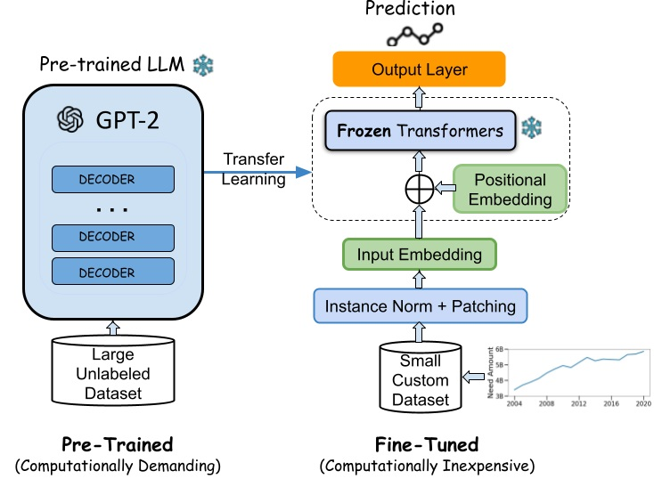
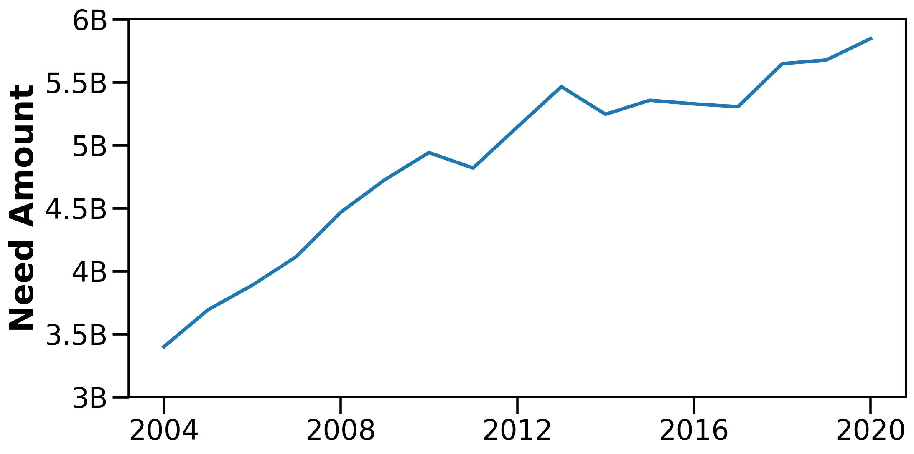
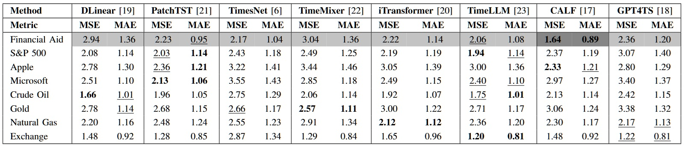
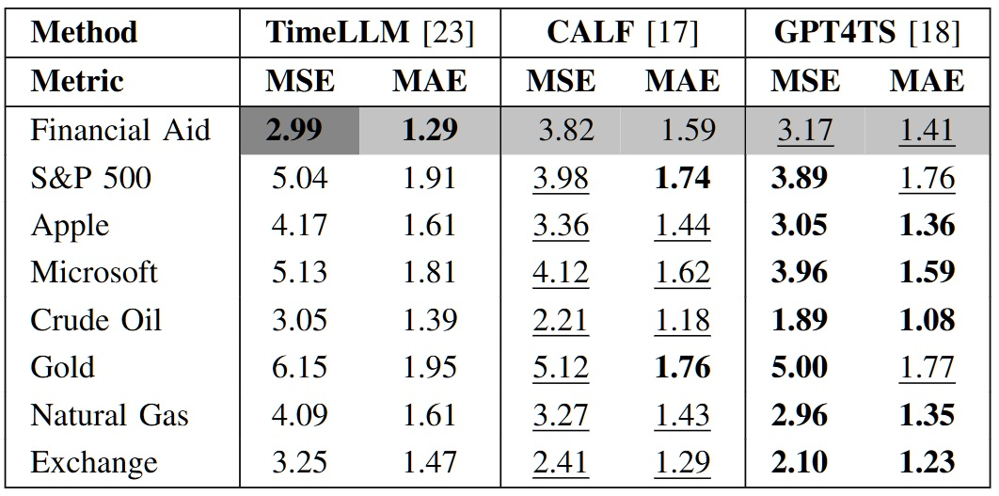

# Financial-Time-Series

Transformer, Foundation Models for Financial Time Series Forecasting (FTSF).

<h3> High-level overview</h3>
Of pre-training an LLM and fine-tuning on a custom dataset (e.g. the Financial Aid dataset) for downstream tasks.



## Dataset

### Financial Aid by US States

Financial aid distributed to each US state by the Government to support student education and collected from years 2004 to 2020 from [InformedStaets.org](https://informedstates.org/state-financial-aid-dataset-download). Details of the available features are in the following Table. Aid is given based on financial needs, academic merit, or both. The sub-categories are simplified and describe multiple features.

| Category | Sub-category | Description |
|:---|:---|:---|
| | Identifier | State id and name abbreviation.|
| | Number | Total students receiving the award. |
| | Public/Private | Whether the funds can be used for public or private sectors and how long (2 or 4 years).|
| Need, Merit, both| Flags | 0 or 1 based on whether the aid falls in a particular category. |
| | Program | Aid program with the most generous eligibility criteria. |
| | Notes | Related text. | 
| | Threshold | GPA, SAT, income, and other academic or financial limits to qualify for the aid. |
| Time | Year | Fiscal or academic year.|
| Target | Amount | Aid amount received by the students. |

<h3> Need amount aggregated at the state level </h3>
From 2004 to 2020 (17 years), in billions of US dollars. Access to historical datasets is limited to yearly intervals.



### Currency Exchange Rate

Representative rates of US dollar for the period August 01, 2014 - August 01, 2024.  
Collected from the [IMF rates database](https://www.imf.org/external/np/fin/ert/GUI/Pages/CountryDataBase.aspx).
These rates, normally quoted as currency units per U.S. dollar, are reported daily to the Fund by the issuing central bank. (The IMF does not maintain exchange rates on weekends and some holidays.) The collected data covers the following currencies:

1. Australian Dollar (AUD)
2. Candian Dollar (CAD)
3. Chinese yuan (CNY)
4. Euro (EUR)
5. Indian rupee (INR)
6. Japanese yen (JPY)
7. U.K. pound (GBP)

Converted to csv using the following

```python
df = pd.read_csv('./data/Exchange_Rate_Report.tsv', sep='\t')
df.drop(['Unnamed: 0', 'Unnamed: 9'], axis=1, inplace=True)
df.fillna(method='ffill').fillna(method='bfill').to_csv(
    './data/Exchange_Rate_Report.csv', 
    sep=',', index=False
)
```

### Stock Market

Daily stock prices (Close, Open, High, Low) and volumes for each stock for upto 10 years from NASDAQ database. 

1. [S&P 500 (SPX)](https://www.nasdaq.com/market-activity/index/spx/historical?page=1&rows_per_page=10&timeline=y10)
2. [Microsoft Corporation (MSFT)](https://www.nasdaq.com/market-activity/stocks/msft/historical)
3. [Apple Inc. (AAPL)](https://www.nasdaq.com/market-activity/stocks/aapl/historical?page=1&rows_per_page=10&timeline=y10)

### Commodity

1. [Natural Gas](https://www.nasdaq.com/market-activity/commodities/ng-nmx/historical?page=1&rows_per_page=10&timeline=y10) 
2. [Crude oil](https://www.nasdaq.com/market-activity/commodities/cl-nmx/historical?page=1&rows_per_page=10&timeline=y10)
3. [Gold](https://www.nasdaq.com/market-activity/commodities/gc-cmx/historical?page=1&rows_per_page=10&timeline=y10)

## Models

Time Series models implemented using the [Time Series Library](https://github.com/thuml/Time-Series-Library)

1. **DLinear** - Are Transformers Effective for Time Series Forecasting? [[AAAI 2023]](https://arxiv.org/pdf/2205.13504.pdf)
2. **iTransformer** - iTransformer: Inverted Transformers Are Effective for Time Series Forecasting [[ICLR 2024]](https://arxiv.org/abs/2310.06625).
3. **TimeMixer** - TimeMixer: Decomposable Multiscale Mixing for Time Series Forecasting [[ICLR 2024]](https://openreview.net/pdf?id=7oLshfEIC2).
4. **PatchTST** - A Time Series is Worth 64 Words: Long-term Forecasting with Transformers [[ICLR 2023]](https://openreview.net/pdf?id=Jbdc0vTOcol).
5. **TimesNet** - TimesNet: Temporal 2D-Variation Modeling for General Time Series Analysis [[ICLR 2023]](https://openreview.net/pdf?id=ju_Uqw384Oq).

Time Series LLM models

1. GPT4TS - [One Fits All (OFA) : Power General Time Series Analysis by Pretrained LM](https://arxiv.org/abs/2302.11939) (NeurIPS 2023 Spotlight)
2. CALF - [CALF - Aligning LLMs for Time Series Forecasting via Cross-modal Fine-Tuning.](https://arxiv.org/abs/2403.07300) (Under review 2024)
3. TimeLLM - [Time-LLM: Time Series Forecasting by Reprogramming Large Language Models](https://arxiv.org/pdf/2310.01728) (ICLR 2024)

## Results

### Which models are better as few-shot learners?

Few-shot learning performance with 10% training data. TimeLLM and PatchTST outperform the other models. The best and the second best results are in bold and underlined.



### Can LLMs perform zero-shot learning in FTSF?

GPT4TS performs the best in zero shot performance. The best and the second best results are in bold and underlined. The traditional models are excluded here since they are not pre-trained.



## Reproduce

Install the required libraries using

```bash
pip install -r requirements.txt
```

Use the `run.py` script for the traditional models. The `run_CALF`, `run_OFA` and `run_TimeLLM` are for the `CALF`, `GPT4TS` and `TimeLLM` respectively. The sample scripts are available in [`scripts`](/scripts/) folder.
